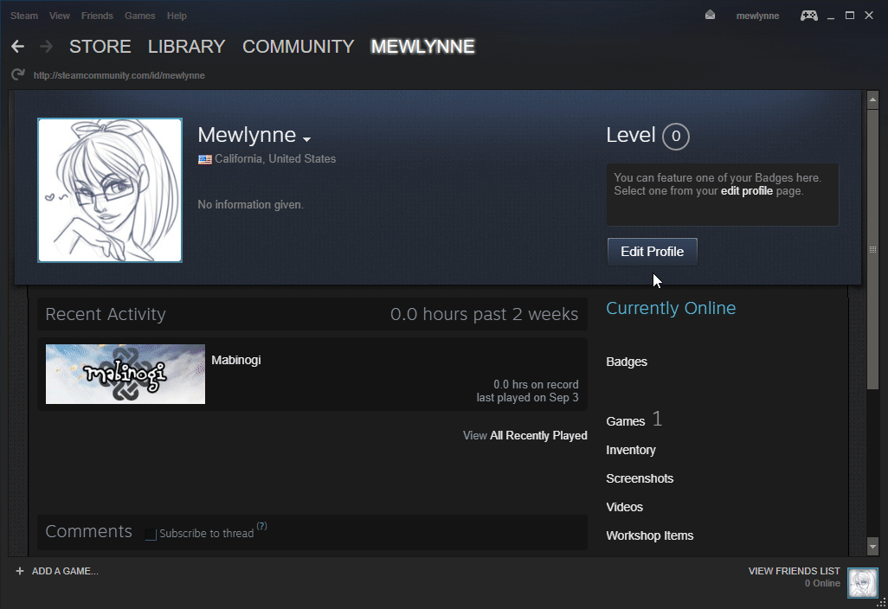

# GitAJob
Aplicacion para la asignatura de dispositivos moviles, que usa la api de steam
  libreria externa --> Picasso
  para eliminar las noticas del recycle view hay que hace swipe, da igual si es derecha o izquierda.
  
  Debido a una peculiaridad de steam, que no es nada más que los ajustes de privacidad de los usuarios, la api te devuelve más o menos atributos para el mismo objeto asi que ha sido un poco caos, al igual que por ejemplo en noticias, el contenido a veces son urls o 3 palabras, 
  
  Para sacar la id de steam, aun asi tengo yo puesta una de default
  
  
  
